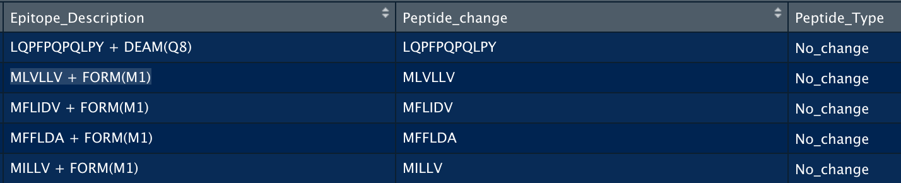
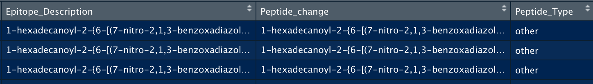
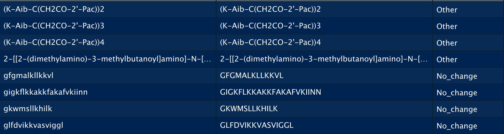
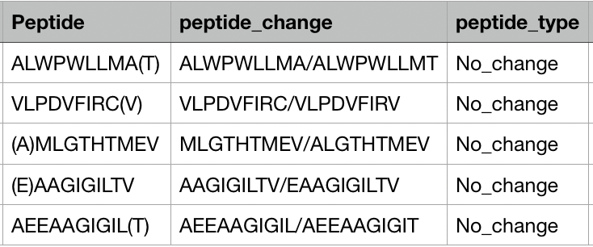
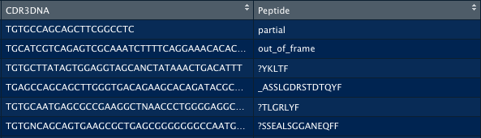
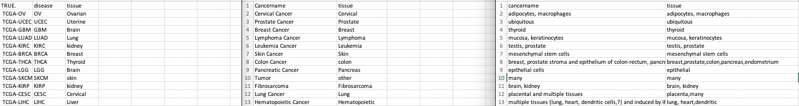

# Neoantigenproject overview
**This is a Neoantigen database project, Used for data preprocessing**

## 1. Introduction of folder and file:
+ /script is a folder with all .R scripts for data preprocessing and data statistic.
+ /data is a folder with all data related with your package(attention:This is for your package not for your projects, It could be generated automatically).
+ /data-raw is a folder with all datasets you would like to put them in your package
+/data_project is a folder with all data related with you project.
+ /R is for All function I would like to create a R package.
+ /man is a document folder for R function, It could be generated by document() function automatically.
+ DESCRIPTION is a file where contain your package meta information.

## 2. create or update your R package:
1. Change R function under /R folder.
2. Add Documentation comment in front of R code.  

  

3. Update DESCRIPTION file if their have a need.
4. library(devtools)
5. document() #update all document file.
6. build() # Build all R function again.
7. You can upload your new R package now.  

## 3. Reference(How to Build a Project and make a package together)

1. create a new project use Rstudio version control system.
[restudio-git-github](https://happygitwithr.com/rstudio-git-github.html)
2. Copy DESCRIPTION and NAMESPACE model files under this folder.
[make a Rpackage](https://www.davekleinschmidt.com/r-packages/)
3. mkdir data_project/script folder(This is for your project,all folder or file related with making package could be generate automatically).  

4. Add all file you need and update with git button.  

5. You can also make sample data in your package.([Add data in your Rpackage](https://www.davekleinschmidt.com/r-packages/))

**Attention:** Please don't forget to git push after you add your commit information.  

**Contact:** If their are any question, please file free to contact with author:jijunyu140@gmail.com

## Description about odd peptide:
<<<<<<< HEAD
**1. mhc_ligand_full_select_col.csvstrange_peptide.csv**

1.1 For all peptides in Epitope_Description column with "[+]", I only kept the first half of the peptide： For example:changed the peptide from "	MLVLLV + FORM(M1)" to "MLVLLV", And I put them into "peptide_change" column; For this kind of situation, There is no need to change classification of peptide but just keeping original classifcation situation.  

=======
1. mhc_ligand_full_select_col.csvstrange_peptide.csv  

1.1 For all peptides in Epitope_Description column with "[+]", I only kept the first half of the peptide： For example:changed the peptide from "	MLVLLV + FORM(M1)" to "MLVLLV", And I put them into "peptide_change" column; For this kind of situation, There is no need to change classification of peptide but just keeping original classifcation situation.  

>>>>>>> 5ec5b1894f33f17eca868a4d6beabad52ba05a50
  

1.2 For all peptides in Epitope_Description column with "-" and complex form, There is no need to change anything but we need to change all of them into other's classification. For example:  

<<<<<<< HEAD
  

By the way, I also put the changed matrix into a new file, which was named as mhc_ligand_full_select_col.csvstrange_peptide_v2.tsv  

**2. CancerPPD_CNRD_strange_peptide.csv**

2.1 The column of "Peptide_change" is the final peptides form.  

2.2 The column of "Peptide_Type" is the classification of change peptides. "Other":means change related peptide to "Other" classification; "no_change":means that we still use the original classification situation.  

2.3 Details are showed below:  

  

By the way, I also put the changed matrix into a new file, which was named as ancerPPD_CNRD_strange_peptide_v2.csv  

**3. tcell_full_v3_select_col.csvstrange_peptide.csv**
The description of this file is same as 2
by the way,I also put the changed matrix into a new file, which was named as tcell_full_v3_select_col.csvstrange_peptide_v2.tsv  

**4. Neoantigen_CNRD.csvstrange_peptide_v2.tsv **
The description of this file is same as 2, A position we need to pay attention to is we need to split the original peptide into two peptide, for example: ALWPWLLMA(T) to ALWPWLLMA/ALWPWLLMT, So after preprocessing, we can get ten peptides now.  

  

by the way,I also put the changed matrix into a new file, which was named as  Neoantigen_CNRD.csvstrange_peptide_v2.tsv 

**5. TCGA_TCR_seq_CNRD_strange_peptide.csv**
We don't need Peptide columns, we Just write it as "CDR3AA", Then if the CDR3AA is wired, Just delete them.

=======

## Description of odd disease
1. This is a description of odd disease, we should classify all disease as tissue, detail as follow:

2. For file: Neoantigen_CNRD.csv_disease_v2.csv
we need to seperate each peptide into different tissue and then classify it.

If you have any question: please feel free to connect me:jijunyu140@gmail.com.

