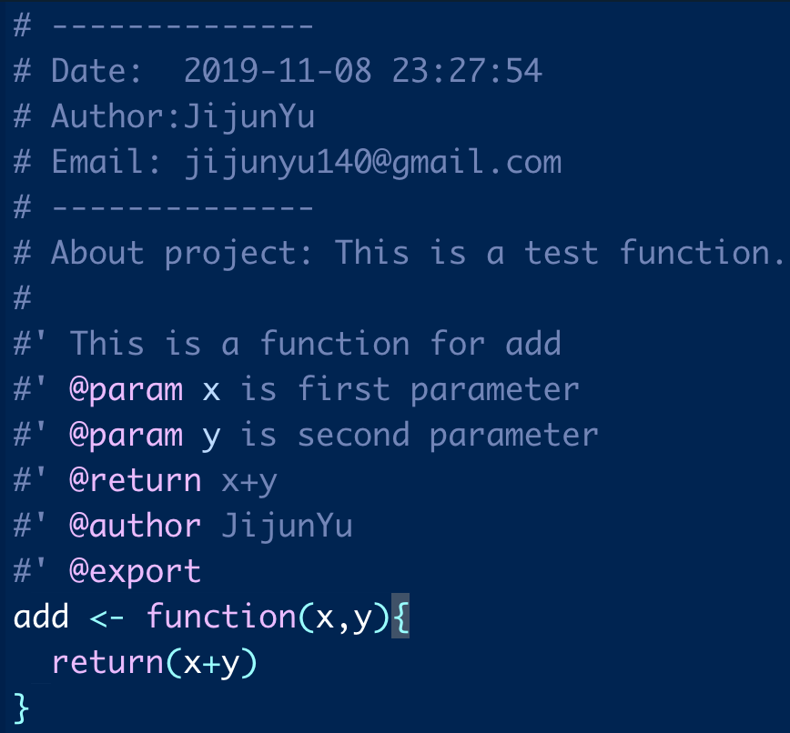
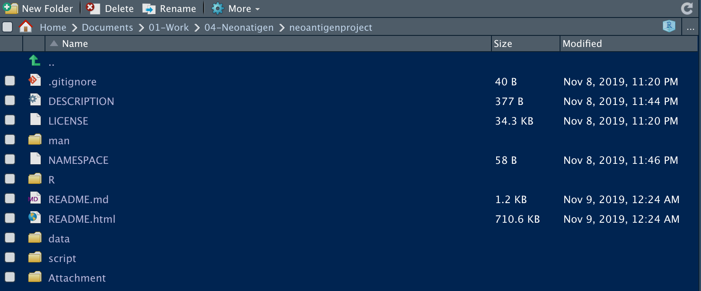
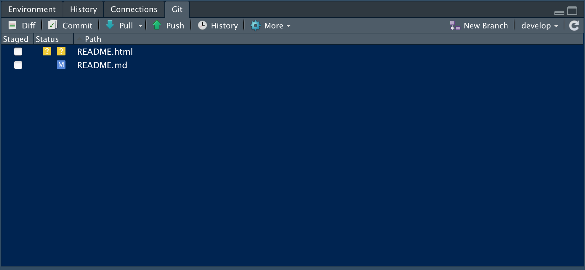

# Neoantigenproject overview
**This is a Neoantigen database project, Used for data preprocessing**

## 1. Introduction of folder and file:
+ /script is a folder with all .R scripts for data preprocessing and data statistic.
+ /data is a folder with all data related with this project.
+ /R is for All function I would like to create a R package.
+ /man is a document folder for R function, It could be generated by document() function automatically.
+ DESCRIPTION is a file where contain your package meta information.

## 2. Update and use R package:
1. Change R function under /R folder.
2. Add Documentation comment in front of R code.  

  

3. Update DESCRIPTION file if their have a need.
4. library(devtools)
5. document() #update all document file.
6. build() # Build all R function again.
7. You can upload your new R package now.  

## 3. Reference(How to Build this Project)

1. create a new project use Rstudio version control system.
[restudio-git-github](https://happygitwithr.com/rstudio-git-github.html)
2. Copy DESCRIPTION and NAMESPACE model files under this folder.
3. mkdir data/script/R folder.  

4. Add all file you need and update with git button.  

**Attention:** Please don't forget to git push after you add your commit information.
